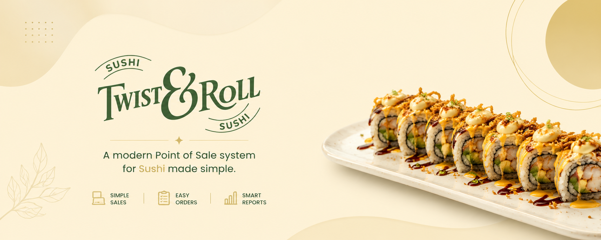
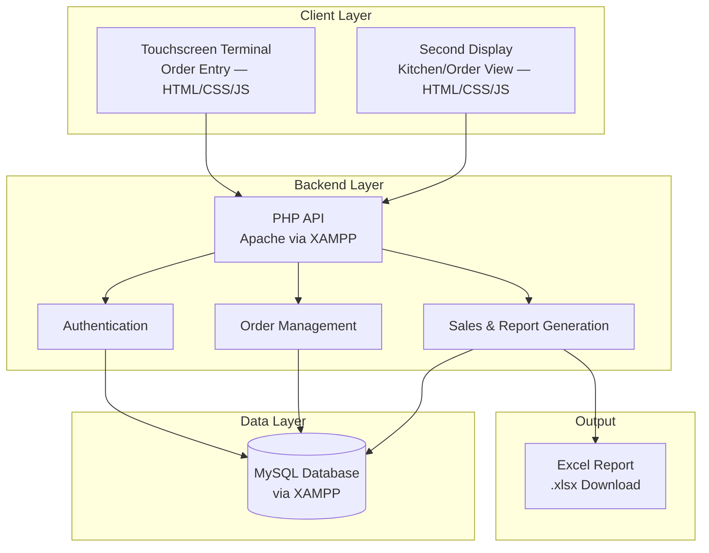

<p align="center">
  
</p>

<h1 align="center">🍣 Twist & Roll POS System</h1>

<p align="center">
  <b>A Point of Sale System for Twist & Roll — Simplifying Orders, Tracking Sales, and Replacing Sticky Notes for Good</b>
</p>

<div align="center">


</div>

---

## 📋 Table of Contents
- [About the Project](#about-the-project)
- [Key Features](#key-features)
- [Technologies Used](#technologies-used)
- [System Architecture](#system-architecture)
- [Getting Started](#getting-started)
- [Contributors](#contributors)
- [License](#license)

---

<a name="about-the-project"></a>
## 📖 About the Project

**Twist & Roll POS System** is a modern, dual-screen point of sale application built for a small sushi business. The system was developed in direct response to the owner's real operational pain points — staff were manually writing orders on sticky notes and computing totals by hand, making it difficult to track orders efficiently during busy hours, especially when handling GCash payments alongside cash transactions.

The system replaces this paper-based workflow with a streamlined digital solution: one touchscreen for taking orders, and a second display screen for the kitchen or customer-facing view showing active orders in real time.

### 🎯 Project Objectives

- **Speed Up Order Taking**: Replace sticky note-based ordering with a fast, touch-friendly interface
- **Real-Time Order Display**: Show active orders simultaneously on a second monitor
- **Track Daily Sales**: Automatically compute total revenue, making end-of-day reporting effortless
- **Monitor Payment Methods**: Track and distinguish between cash and GCash transactions
- **Excel Report Export**: Generate sales summaries in Excel format so the owner can review daily earnings and losses

### 🏪 Client Context

**Twist & Roll** is a small sushi business run by a family. With only two staff members serving customers, speed and simplicity are critical. The business needed a system that:

- Handles order entry quickly on a touchscreen
- Displays ongoing orders on a separate monitor
- Tracks cash and GCash payments (reference number logging)
- Generates exportable Excel sales reports for owner review

> ⚠️ **Current Scope Note**: The pasta menu has not yet been removed from the system. The owner intends to move to a sushi-only menu, but this will be reflected in a future update. Online payment gateway integration (GCash), receipt printing, and customer beeper systems are not yet included in this version and are planned for future releases.

---

<a name="key-features"></a>
## ✨ Key Features

<table>
<tr>
<td width="50%" valign="top">

### 🖥️ Touchscreen Order Terminal
- ✅ **Fast Menu Selection**  
  Tap to add sushi (and current pasta) items to an order
- 🧾 **Live Order Summary**  
  See itemized order with quantities and running total
- 💵 **Cash & GCash Support**  
  Accept cash payments or log GCash reference numbers
- ❌ **Order Editing**  
  Remove or adjust items before confirming

</td>
<td width="50%" valign="top">

### 📺 Kitchen / Second Display
- 👁️ **Real-Time Order Feed**  
  Orders appear on the second monitor as soon as they're placed
- 📋 **Active Order Queue**  
  Staff can see all pending orders at a glance
- ✅ **Order Completion Marking**  
  Mark orders as done directly from the display

</td>
</tr>
</table>

### 📊 Additional Capabilities
- **Daily Sales Summary**: Automatic computation of total revenue, number of orders, and breakdown by payment method
- **Excel Report Export**: Download sales data in `.xlsx` format for owner review and bookkeeping
- **Transaction History**: View a log of all completed orders for the day
- **GCash Reference Logging**: Record GCash reference numbers per transaction for verification
- **Menu Management**: Add, edit, or remove menu items as the business evolves
- **Dual-Monitor Support**: Designed for simultaneous touchscreen + secondary display operation

---

<a name="technologies-used"></a>
## 🛠 Technologies Used

<div align="center">

### **Frontend Development**


### **Backend Development**


### **Database & Storage**


### **Reporting**


### **Development Tools**


</div>

---

### **Technology Stack Details**

<details>
<summary><b>🖥️ Frontend Technologies</b></summary>

| Technology | Purpose | Role |
|------------|---------|------|
| **HTML5** | Structure and content markup | Web page structure |
| **CSS3** | Styling and responsive design | Visual presentation |
| **JavaScript** | Interactive functionality | Client-side logic, dual-screen management |
| **Figma** | UI/UX design and prototyping | Wireframes and interface design |

</details>

<details>
<summary><b>⚙️ Backend Technologies</b></summary>

| Technology | Purpose | Role |
|------------|---------|------|
| **PHP** | Core backend programming | Server-side logic and API handling |
| **XAMPP** | Local development environment | Apache server + MySQL hosting |
| **REST API** | Client-server communication | Real-time order and data exchange |

</details>

<details>
<summary><b>💾 Database & Storage</b></summary>

| Technology | Purpose | Role |
|------------|---------|------|
| **MySQL** | Relational database (via XAMPP) | Orders, menu items, transaction records |
| **phpMyAdmin** | Database management interface | Local DB administration |

</details>

<details>
<summary><b>📊 Reporting</b></summary>

| Technology | Purpose | Role |
|------------|---------|------|
| **Excel (.xlsx) Export** | Sales reporting | Daily revenue summaries for the owner |

</details>

---

<a name="system-architecture"></a>
## 🏗 System Architecture

<div align="center">



</div>

### **Architecture Overview**

Twist & Roll POS follows a **three-tier client-server architecture** optimized for dual-screen, single-location operation:

1. **Presentation Layer** (Client)
   - Touchscreen terminal for order entry
   - Second monitor for real-time order display (kitchen/staff view)

2. **Application Layer** (Backend)
   - PHP-based API served via Apache (XAMPP)
   - Order processing, payment logging, and report generation
   - Session-based authentication for staff

3. **Data Layer** (Database)
   - MySQL database running locally via XAMPP
   - Stores menu items, orders, transactions, and daily sales records

---

<a name="getting-started"></a>
## 🚀 Getting Started

### Prerequisites

```bash
# Required installations
✓ XAMPP (Apache + MySQL + PHP)
✓ Git
✓ A modern browser (for dual-monitor setup)
```

### Installation

#### **1️⃣ Clone the Repository**

```bash
git clone https://github.com/YOUR_REPO_URL/twist-and-roll-pos.git
```

Move the project folder into your XAMPP `htdocs` directory:

```
C:/xampp/htdocs/twist-and-roll-pos/
```

#### **2️⃣ Start XAMPP**

1. Open the **XAMPP Control Panel**
2. Start **Apache** and **MySQL**

#### **3️⃣ Set Up the Database**

1. Open your browser and go to `http://localhost/phpmyadmin`
2. Create a new database (e.g., `twist_and_roll`)
3. Import the provided SQL file:
   ```
   database/twist_and_roll.sql
   ```
4. Update the database config file with your credentials:
   ```php
   // config/db.php
   define('DB_HOST', 'localhost');
   define('DB_USER', 'root');
   define('DB_PASS', '');
   define('DB_NAME', 'twist_and_roll');
   ```

#### **4️⃣ Run the Application**

```
# Touchscreen terminal
http://localhost/twist-and-roll-pos/

# Second display (kitchen/order view)
http://localhost/twist-and-roll-pos/display
```

### 🖥️ Dual-Monitor Setup

1. Connect the second monitor to the POS machine
2. Open the **Order Terminal** (`/`) on the touchscreen display
3. Open the **Order Display** (`/display`) on the second monitor
4. Orders placed on the terminal will appear in real time on the display

---

<a name="contributors"></a>
## 👥 Contributors

<div align="center">

### **Development Team**

<table>
  <tr>
    <td align="center" width="33%">
      <a href="https://github.com/Snowden199x">
        
        <br />
        <sub><b>Patrick John M. Goco</b></sub>
      </a>
      <br /><br />
      
      <br />
      
      
      
      
      <br />
      <sub>🔧 API Development | Database Design</sub>
    </td>
    <td align="center" width="33%">
      <a href="https://github.com/diannaramilo">
        
        <br />
        <sub><b>Dianna Rose M. Ramilo</b></sub>
      </a>
      <br /><br />
      
      <br />
      
      
      
      
      
      <br />
      <sub>🎨 Web Design | Frontend Development</sub>
    </td>
    <td align="center" width="33%">
      <a href="https://github.com/Zamuelle-Lorenzo-IT2D">
        
        <br />
        <sub><b>Zamuelle Timothy H. Lorenzo</b></sub>
      </a>
      <br /><br />
      
      <br />
      
      
      
      
      
      <br />
      <sub>💻 Frontend Development | Backend Support</sub>
    </td>
  </tr>
  <tr>
    <td align="center" colspan="3">
      <a href="https://github.com/hannahoriel">
        
        <br />
        <sub><b>Hannah Oriel</b></sub>
      </a>
      <br /><br />
      
      <br />
      
      
      
      
      <br />
      <sub>💻 Frontend Development | UI Implementation</sub>
    </td>
  </tr>
</table>

</div>

---

### **Roles and Responsibilities**

<details>
<summary><b>🔧 Patrick John M. Goco — Backend Developer</b></summary>
<br>

- Backend architecture and API development (PHP)
- Database design and management (MySQL via XAMPP)
- Order processing, payment logging, and session management
- RESTful API endpoints for order and sales operations
- Excel report generation logic
- Integration between frontend terminals and backend

**Tech Stack**: PHP, MySQL, XAMPP, REST API

</details>

<details>
<summary><b>🎨 Dianna Rose M. Ramilo — UI/UX Designer & Frontend Developer</b></summary>
<br>

- User interface design and prototyping in Figma
- Web frontend development (HTML, CSS, JavaScript)
- Responsive and touch-friendly layout implementation
- Visual design and branding
- UI/UX testing and refinement

**Tech Stack**: HTML5, CSS3, JavaScript, Figma

</details>

<details>
<summary><b>💻 Zamuelle Timothy H. Lorenzo — Frontend & Backend Developer</b></summary>
<br>

- Frontend development and UI implementation
- Backend support and PHP scripting
- Feature integration between UI and server logic
- User testing and feedback implementation

**Tech Stack**: HTML5, CSS3, JavaScript, PHP

</details>

<details>
<summary><b>💻 Hannah Oriel — Frontend Developer</b></summary>
<br>

- Frontend development and UI implementation
- Second display (kitchen/order view) development
- Frontend integration with PHP backend
- User testing and interface refinement

**Tech Stack**: HTML5, CSS3, JavaScript

</details>

---

## 📊 Development Status & Roadmap

<div align="center">


</div>

### Development Timeline

- [x] ✅ Requirements gathering with client
- [x] ✅ System design and UI/UX prototyping
- [x] ✅ Database schema implementation
- [x] ✅ Backend API development
- [x] ✅ Touchscreen order terminal
- [x] ✅ Second display (real-time order view)
- [x] ✅ GCash reference number logging
- [x] ✅ Excel sales report export
- [ ] ⏳ Online payment gateway integration (GCash API)
- [ ] ⏳ Receipt printer integration
- [ ] ⏳ Customer beeper system support
- [ ] ⏳ Pasta menu removal (client pending decision)
- [ ] ⏳ Final user acceptance testing
- [ ] ⏳ Deployment and handover

---

## 🔍 Testing & Quality Assurance

### Evaluation Criteria

<div align="center">

| Criterion | Description |
|-----------|-------------|
| ⚡ **Speed** | Order entry must be fast enough for peak service hours |
| 👤 **Usability** | Staff with minimal tech experience can use it without training |
| 🔄 **Real-Time Sync** | Orders appear on second monitor immediately after confirmation |
| 💵 **Payment Accuracy** | Cash and GCash totals must be computed and logged correctly |
| 📊 **Report Accuracy** | Excel exports must match actual daily transaction data |
| 🛡️ **Error Handling** | Graceful handling of duplicate orders, empty carts, and network issues |

</div>

---

<a name="license"></a>
## 📝 License

This system was developed as a commissioned project for Twist & Roll. All rights to the codebase are reserved by the development team and the client.

**© 2026 Twist & Roll POS Development Team. All rights reserved.**

---

## 📞 Contact & Support

<div align="center">

**Have questions about the system?** Reach out to the development team.

🏫 **Developed by students of LSPU-SCC — College of Computer Studies**

</div>

---

## 🙏 Acknowledgments

Special thanks to:
- **The Twist & Roll Owner and Family** for trusting us with this project and providing clear, real-world requirements
- **Twist & Roll Staff** for participating in user testing and feedback sessions
- **LSPU-SCC College of Computer Studies Faculty** for academic guidance and supervision

---

<div align="center">

### 🍣 Built for Twist & Roll

**Twist & Roll POS** — *No more sticky notes. Just fast, clean orders.*

---


</div>
